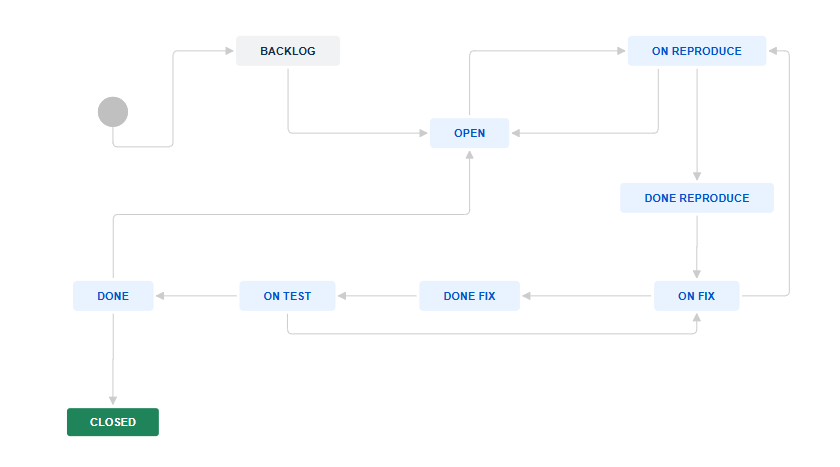
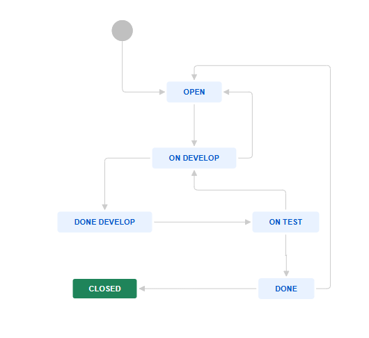
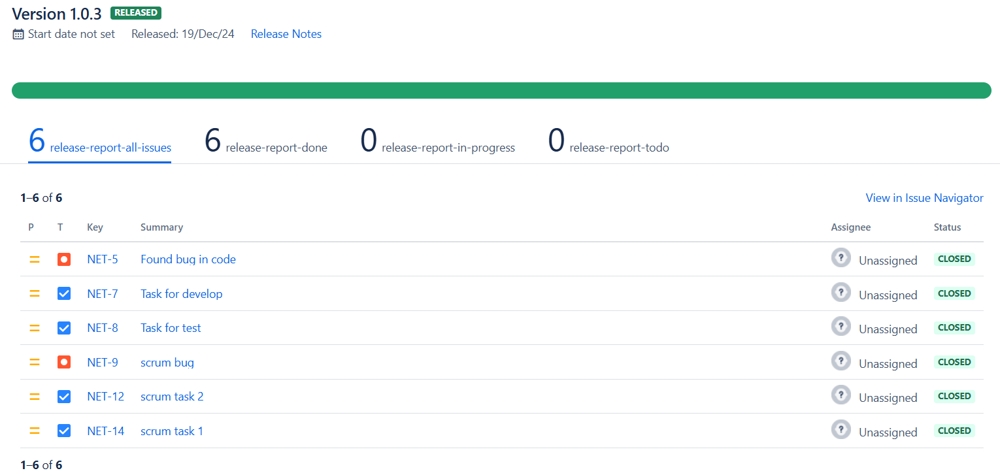

# Домашнее задание к занятию 7 «Жизненный цикл ПО»

## Workflow для bug

[Workflow xml](<Software Simplified Workflow for Project NET.xml>)

## Workflow для epic с привязанными к нему task

[Workflow xml](<Workflow for others.xml>)

## Screenshots

Скриншот kanban release

Скриншот завершенного спринта

